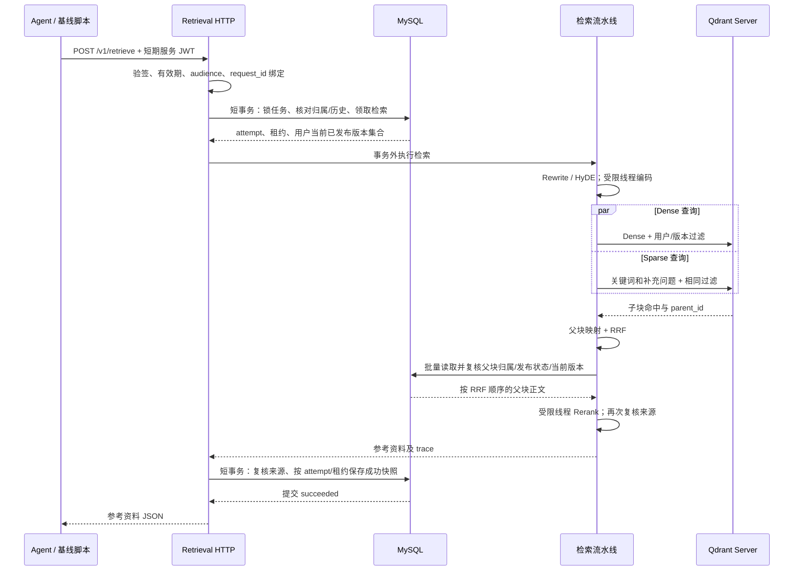

# 第五阶段：Retrieval 服务

这一阶段把原检索算法放进独立 HTTP 服务：输入是数据库中已有聊天任务的检索意图，输出是有来源、版本和父块 ID 的参考资料。Retrieval 保存一次成功检索及 trace；聊天答案、RabbitMQ 消费与 Redis token 输出留给第六阶段 Agent Worker。

## 1. 沿这条阅读顺序掌握代码


| 顺序  | 文件                                                                                       | 要弄清楚的问题                            |
| --- | ---------------------------------------------------------------------------------------- | ---------------------------------- |
| 1   | `core/retrieval_contracts.py`                                                            | 接口收什么、返回什么；为什么请求不接收 user_id 或版本范围？ |
| 2   | `services/retrieval/app.py`                                                              | FastAPI 如何在启动时检查依赖、加载模型，在退出时关闭资源？  |
| 3   | `core/service_auth.py`                                                                   | 服务 JWT 如何绑定用户、request_id、用途和有效期？   |
| 4   | `services/retrieval/service.py`                                                          | 总超时、受理上限、事务和算法调用分别在哪里控制？           |
| 5   | `infra/mysql/repositories/retrieval.py`                                                  | 怎样授权、领取检索、读取父块，以及保存或复用成功结果？        |
| 6   | `services/retrieval/Search_Internal_Docs.py`                                             | 改写、并发召回、RRF、父块查询和重排如何串起来？          |
| 7   | `services/retrieval/qdrant_shared.py`、`Qdrant_Search_Dense.py`、`Qdrant_Search_Sparse.py` | 每一路网络查询是否带同一用户和版本过滤？               |
| 8   | `services/retrieval/compute.py`、`models_runtime.py`                                      | 同步计算怎样移出事件循环；取消请求后为什么仍占用计算槽？       |
| 9   | `tests/test_retrieval_component.py`、`scripts/check_retrieval_baseline.py`                | 哪些边界可以离线证明，哪些必须用真实中间件和模型验收？        |


第一次阅读先停在第 5 步，把“谁能查、怎样避免重复成功、失败如何恢复”弄清楚，再进入召回算法。所有本轮新增函数都有中文 `作用` 注释。

## 2. 一次请求按时间发生什么

假设用户 A 的员工手册版本 V1 已发布。Agent 已领取聊天任务 R1，任务状态是 `running`，执行租约有效；数据库中本次用户消息是“根据员工手册，我每年有多少天年假？”。




### T0：校验接口与可信身份

`RetrieveRequest` 限制请求长度、消息角色，要求最后一条是 user 消息。传入额外的 user_id、version_ids 等字段会得到 422。服务 JWT 使用专用密钥和固定 HS256，校验签名、issuer、audience、用途、签发时间、到期时间以及请求绑定。

JWT 合法只说明调用方有服务凭据。实际能否读取 R1，仍由数据库的任务归属决定。不存在或属于他人的任务返回 404；JWT 的 request_id 与请求正文不一致返回 403。

### T1：短事务领取检索执行权

`claim_retrieval()` 锁定 A 的 chat_requests 行，让同一请求的并发调用依次检查检索状态。随后核对会话归属，以及传入消息是否与数据库中截至 history_until_sequence 的历史后缀完全一致。本次最后一条必须对应 user_message_id。可以裁掉完整的早期轮次，不能改写已保存消息的正文。

首次调用要求聊天任务正在执行且租约有效，并读取 A 的**当前已发布版本**，例如 `[V1]`。不是调用方提供版本范围。版本的 Dense/Sparse 模型名称必须与查询配置一致，否则返回 index_model_mismatch。

数据库新建 retrieval_runs：保存 R1、A、search_query 和规范化输入，状态为 running，attempt=1，记录独立的检索租约拥有者和到期时间。事务随即提交，释放任务行锁。

### T2：事务外执行改写和召回

`QueryTransformer` 保留原来的 Rewrite / HyDE 与失败降级逻辑：较完整的 search_query 直接作为关键词，短查询可由 LLM 改写；Dense 使用 HyDE，生成失败则使用当前问题。Sparse 包括关键词一路，以及内容不同的原问题补充一路。

fixed 模式跳过 LLM 改写和 HyDE 生成，分别使用固定 search_query 与问题进行检索，隔离生成波动。**Embedding、Qdrant、RRF 和 Reranker 仍真实执行**。

TaskGroup 同时调度 Dense 和每一路 Sparse。每个分支在受限线程里编码，再 await AsyncQdrantClient.query_points()。所有分支都携带 `user_id=A AND version_id IN [V1]`。用户无已发布版本时直接返回空结果，绝不构造无过滤的全库查询。

这一段不会修改业务表，Qdrant 只读取已有向量点。

### T3：正文进入模型之前再次授权

子块通过 parent_id 映射到父块，RRF 融合各路排名，取前 15 个候选。Docs_for_Reranker.py 创建独立异步会话，批量查询 MySQL 的 parent_chunks，核对用户、文档与版本关系、发布状态和当前版本，保留 RRF 顺序。

只有查到并授权的父块正文才进入 CrossEncoder。重排取前 5 个，随后再次复核当前版本；检测到版本切换时丢弃失效候选。trace 的命中列表也只保留通过父块复核的候选，避免记录未经授权的父块标识。

这一段只读 MySQL。正文不再来自 docstore.json，Qdrant payload 中也不读取正文给模型。

### T4：保存成功结果后才返回

RetrievalService 再开短事务，复核来源，然后 finish_retrieval() 用 `status=running + owner + attempt + 未过期租约` 条件更新。

R1 的检索记录改为 succeeded，保存完整 result_data、retrieved_parent_ids、source_version_ids 和 trace，清空租约。提交后返回 JSON，保留原工具的 status、doc_count、retrieved_parent_ids、knowledge_content，新增结构化 documents，包含 document_id、version_id、来源与分数。

**聊天任务仍是 running，尚未写 assistant 消息。** Retrieval 成功表示参考资料已经准备好；Agent 后续生成答案并完成聊天任务。

## 3. 重复调用、故障和版本切换


| 情况                      | 数据库与接口行为                                                   |
| ----------------------- | ---------------------------------------------------------- |
| R1 相同输入正在执行             | 有效检索租约使重复调用返回 409 retrieval_in_progress，不启动另一条流水线          |
| R1 已成功，同输入再次调用          | 复用成功快照，重新核对父块归属、发布状态及正文；不再调用模型或 Qdrant                     |
| R1 更改 search_query 或上下文 | 不满足历史约束或不可变输入约束，返回 409                                     |
| 查询正常结束但没有命中             | HTTP 200，响应 status=empty，检索记录为 succeeded 并可复用；依赖故障不会伪装为无命中 |
| Qdrant / 模型计算失败         | 保存 failed 和安全错误码，返回 502；同输入可以重新领取，attempt 增加               |
| 总时限到期                   | 返回 504，尽量保存 failed；失败状态清理另有至多 3 秒时限                        |
| 数据库故障或进程退出，失败状态未保存      | 检索租约到期后，相同输入可在有效聊天任务租约下重新领取                                |
| 旧计算在重领后才完成              | attempt 和租约条件使旧执行者无法覆盖结果                                   |
| 在途请求达到上限                | 返回 503 retrieval_overloaded，不再领取数据库检索记录                    |


每个 request_id 最多保存一次成功的逻辑检索；成功前失败或网络中断可能导致底层计算再次执行。这不承诺外部调用恰好一次。

首次检索只使用当前已发布版本。已经成功的 R1 复用**保留的已发布来源快照**：V2 发布之后，只要 V1 仍保留、已发布且属于 A，R1 继续复用 V1，避免重试时参考资料变化。下一条新请求 R2 使用 V2。若 V1 被撤销、删除或正文变化，复用返回 409 retrieval_snapshot_unavailable；不静默重做已成功的 R1。以后做旧版清理时，需要考虑成功检索快照的保留期限。

## 4. 为什么这样安排文件和并发

- app.py 管 HTTP 和生命周期；service.py 管跨步骤的用例、事务、幂等和超时；Repository 管 MySQL 读写，**不自行 commit**。
- Search_Internal_Docs.py 管算法顺序；Dense/Sparse 管编码和各自网络查询；qdrant_shared.py 集中构造权限过滤，减少分支遗漏。
- core/index_config.py 让 Ingest 与 Retrieval 共用模型名称。models_runtime.py 在启动时加载模型，其他算法文件没有全局模型或客户端。
- 默认最多受理 8 个请求、执行 2 条流水线；共享本地模型由单线程执行器串行使用，避免未经验证的模型线程安全问题。两条流水线的网络 I/O 可以重叠，本地模型推理并不同时运行。
- 取消等待协程不能强制终止正在运行的同步模型。计算真正结束前仍占用执行槽，防止超时后的后台计算突破并发上限。停机也等待在途计算结束。
- 默认总时限 60 秒，检索租约 90 秒；配置要求租约比请求时限至少长 10 秒。检索不续租，依靠有界时限和租约余量。超时只保证等待有界，不能立即回收推理占用的 CPU/GPU。
- 先使用 Uvicorn --workers 1。增加 Worker 会各自加载模型并各自拥有并发上限，需要先测量内存/显存。进程内上限不会自动变成跨实例的全局上限。

启动仅检查 MySQL、Qdrant、服务凭据及当前模式所需的模型 API 配置，不要求 Redis 或 RabbitMQ 可用。先校验迁移和集合，再加载模型；导入 app 模块不会读取服务密钥、连接数据库或下载模型。/health 表示启动就绪，运行时依赖故障由实际请求错误反馈。

## 5. 本机启动与验收

已有 .env 时只补充 .env.example 中的 RETRIEVAL_* 配置。生成一个独立随机密钥，填写 RETRIEVAL_SERVICE_SECRET，后续 Agent 与 Retrieval 使用同一内部密钥，不复用浏览器登录密钥：

```powershell
python -c "import secrets; print(secrets.token_urlsafe(48))"
```

先完成部署说明中的中间件启动、bootstrap 和第四阶段样本入库。随后执行：

```powershell
python -m pip install -r requirements.txt
python -m alembic upgrade head
```

本轮迁移 0003_retrieval_run_lease.py 添加 attempt 和检索租约。同时将第四阶段 revision 改为 0002_version_storage_key，使其长度满足 Alembic 默认版本列的 32 字符限制；迁移文件名和表结构逻辑不变。

为固定基线，将 .env 设置为 RETRIEVAL_QUERY_MODE=fixed，然后在独立终端运行：

```powershell
python -m uvicorn services.retrieval.app:app --host 127.0.0.1 --port 8001 --workers 1
```

首次启动可能下载 Embedding/Sparse/Reranker 模型，加载完成后才接受请求。在另一个终端运行，变量填写第四阶段已经成功的真实任务 ID：

```powershell
$ingestJobId = "填写第四阶段的入库任务 UUID"
python -m scripts.check_ingest_baseline $ingestJobId
python -m scripts.check_retrieval_baseline $ingestJobId
```

验收脚本核对样本文档哈希及已发布版本，为每个问题建立独立测试会话、消息和有执行租约的 ChatRequest，再并发发送问题及同请求重复调用，检查来源、正文、成功结果复用和数据库 trace。报告写到 outputs/retrieval_baseline.json，不输出服务凭据。

测试任务不投递给 RabbitMQ。检索验收结束后，ChatRequest 以 failed 结束，并注明没有执行 Agent 答案生成，释放会话；RetrievalRun 保留 succeeded。这两种状态分别描述聊天和检索，不矛盾。脚本保留测试记录供你按 request_id 回查，不自动删除。

固定基线通过后改回 RETRIEVAL_QUERY_MODE=llm，填写生成模型 API 配置并重启服务，单独评估 Rewrite / HyDE 的效果。

离线组件测试：

```powershell
python -m unittest tests.test_retrieval_component -v
python -m unittest discover -s tests -v
```

离线测试使用临时 SQLite 和模型/向量库替身，覆盖 HTTP 凭据校验、任务与历史归属、每一路过滤、模型前父块隔离、三路并发调度、成功复用、失败重试、过期执行者拒写、总超时、受理上限、计算取消，以及 Rewrite/HyDE 并发与生成失败降级。**SQLite 无法证明 MySQL 行锁竞争，替身无法证明真实模型的召回质量**；真实基线脚本是后续验收入口。

## 6. 留给第六阶段的接点

旧 Agent 工具仍是直接调用检索函数，没有任务身份或 HTTP 凭据。新算法入口要求显式授权范围与运行时，旧路径不能继续无身份检索。第六阶段按计划把工具改为复用异步 HTTP 客户端、为已领取任务签发专用凭据，并传入截至本次提问的数据库历史后缀。

当前可以独立运行和验收 Retrieval，完整 Agent 聊天链路尚未接入。服务只供内部调用，本机绑定 127.0.0.1，浏览器后续只请求网关。

## 7. 学习时逐项验证

1. 用报告中的 request_id 查询 chat_requests 和 retrieval_runs，解释为何检索 succeeded 不代表聊天 succeeded。
2. 沿 service.py 的两个 session.begin() 找出领取与成功提交边界，确认模型计算期间没有持有任务行锁。
3. 在每个 query_points 调用中找到 query_filter，说明为何只在响应阶段过滤会泄露信息给重排模型。
4. 读 compute.py 的 shield 和完成回调，解释请求超时之后为什么不能立即让下一次计算共用模型。
5. 用相同输入重复调用，确认 attempt 没有增加；理解失败时为何允许 attempt 增加。

官方参考：[FastAPI lifespan](https://fastapi.tiangolo.com/advanced/events/)、[Qdrant 异步 API](https://qdrant.tech/documentation/tutorials-develop/async-api/)、[PyJWT claims 校验](https://pyjwt.readthedocs.io/en/latest/usage.html)。