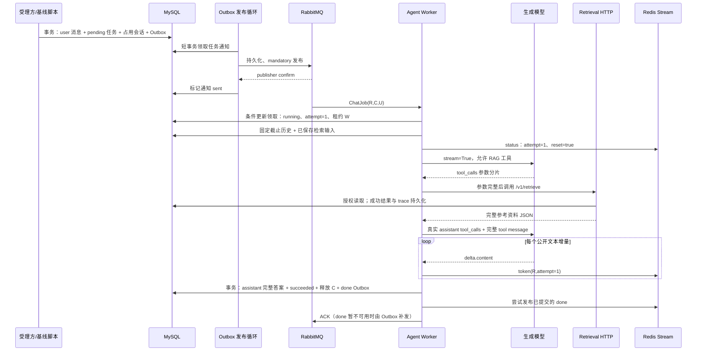

# 第六阶段：Agent Worker 与流式事件

本阶段接通的是 **MySQL 任务 → RabbitMQ 通知 → Agent → Retrieval HTTP → 模型增量 → Redis Stream → MySQL 完整答案**。浏览器入口、JWT 登录和 SSE 编码按第七、八阶段实现。现在可以用真实任务基线脚本走完 Worker 链路。

Agent 是独立队列进程。它不导入 Retrieval 算法、不加载 Embedding / Reranker，也不连接 Qdrant。HTTP 客户端、模型 SDK、Redis、RabbitMQ 和 MySQL 连接池在启动时创建，退出时关闭。没有新增表或迁移，复用已有任务、消息、检索快照和 Outbox。

## 1. 先按这个顺序读代码

先沿一条成功请求读完，再读失败分支。不要从配置和所有底层函数开始逐个阅读。

| 顺序 | 文件与入口 | 它决定什么 |
| --- | --- | --- |
| 1 | `core/chat_contracts.py`：`ChatJob`、`AgentEvent`、`ChatStreamEvent` | 队列只传任务身份；引擎产出结构化事件；Stream 事件包含请求和 attempt |
| 2 | `infra/mysql/repositories/chat.py`：`accept_chat` | 锁会话、固定历史截止点，把 user 消息、pending 任务、会话占用和通知意图一起保存 |
| 3 | `services/agent/delivery.py`：`handle_message` | 核对队列身份、领取执行权；成功、重试、最终失败分别何时 ACK 或拒绝 |
| 4 | `services/agent/processor.py`：`execute_attempt` → `generate_and_commit` | 心跳监督生成；先 reset、再增量；只有正常结束的完整答案能提交 |
| 5 | `services/agent/engine.py`：`run_agent_async`、`ToolCallBuffer` | `stream=True`；累积工具分片；完整参数才执行；只有 content 形成答案 token |
| 6 | `services/agent/retrieval_client.py`：`RetrievalContext.search`、`RetrievalClient.retrieve` | 输入按请求固定，使用内部 JWT 调 HTTP；成功资料完整复用，错误传播给任务编排 |
| 7 | `infra/redis_streams.py`：`ChatStreams` 与四段 Lua | 原子核对 attempt/owner 后写事件、续期和终态去重；活动流不裁剪 |
| 8 | `infra/mysql/repositories/chat.py`：`finish_chat`、`fail_chat`、`recover_expired_chats` | 原子保存完整答案或失败安排；旧 attempt、过期租约不得覆盖新状态 |
| 9 | `services/agent/outbox.py`：`publish_once`、`try_publish_terminal` | 发任务依赖 publisher confirm；终态先验证 MySQL；通知失败留待补发 |
| 10 | `services/agent/worker.py`：`create_runtime`、`run_worker` | 将客户端和循环装配起来；限制并发；Ctrl+C 先停止领取、再排空和关闭 |

辅助入口：`services/agent/tools/my_tools.py` 只有 RAG 工具及可信上下文注入；`tool_registry.py` 根据类型声明生成 schema，并拒绝多余参数。`core/config.py` 只在启动时读取 Agent 所需配置；Agent 只需要 Retrieval 的内部签名配置和地址，不加载 Retrieval 的计算配置。

你需要优先掌握三个调用关系：

```text
受理：外层事务 → accept_chat → user 消息 + pending 任务 + RabbitMQ Outbox
执行：handle_message → claim_task → execute_attempt → run_agent_async
收尾：finish_chat → 外层提交 → try_publish_terminal → 消息 ACK
```

Repository 不自己 commit。`delivery.py`、`processor.py` 和 `outbox.py` 的 `session.begin()` 才是事务边界；模型生成、HTTP 和 Redis I/O 均不放在这些事务里。

## 2. 用“我每年有多少天年假？”串起时间线

假设用户 U 在会话 C 提问，本次任务是 R，执行者是 W，首次 attempt 是 1。



对照数据库可以看到这些变化：

| 时点 | `messages` | `chat_requests` | `conversations` | `outbox_events` / `retrieval_runs` |
| --- | --- | --- | --- | --- |
| 提问受理后 | 增加一条 user，sequence=N | R=`pending`、attempt=0；记录消息 ID 和截止 N | `active_request_id=R`；下个序号 N+1 | 增加 RabbitMQ 通知，pending |
| 通知确认发布后 | 无新增 | 仍可能 pending | 仍占用 | 通知 sent；它表示通知送达，不表示工作完成 |
| Worker 领取后 | 无新增 | running、attempt=1、owner=W、到期时间 | 仍占用 | 领取是条件更新，同一任务只有一个执行者成功 |
| 检索成功后 | 无新增 | running | 仍占用 | `retrieval_runs` 保存输入、成功资料、父块 ID、版本和 trace |
| token 回流期间 | **没有 assistant 半段答案** | running，心跳续租 | 仍占用 | token 只进 `chat:R`，应用内同时累计文本 |
| 正常完成事务提交后 | 新增一条 assistant，sequence=N+1 | succeeded、保存答案 ID、清空租约 | 清空 active；下个序号 N+2 | 增加 Redis done Outbox，pending |
| done 发布后 | 完整答案保持 | succeeded | 下一次问题可受理 | 终态 Outbox sent；Stream 设置终态保留期 |

消息 ACK 不负责保存答案。即使进程在完成事务提交后、ACK 前退出，重复投递也只读取 succeeded 和补通知，不再调用模型。MySQL 中的状态与完整答案是最终事实。

## 3. 关键设计选择

### 固定历史与失败轮次

`load_chat_context` 同时检查 `user_message_id`、`history_until_sequence`、消息角色、请求归属和会话占用。读取范围止于本次 user 消息，后来的提问不能进入旧任务。

当前失败轮次策略：找到本次问题之前最近一个 failed 请求的 user 序号，**将该序号及之前的模型上下文整体截断**，保留后面的连续原始消息后缀。数据库中的历史并未删除。这一策略避免把没有成功答案的提问当作已完成对话，也满足 Retrieval 对“连续真实历史后缀”的检查；代价是跨失败轮次的指代需要用户重新说明。

历史最多 100 条、60000 字符，每条最多 12000 字符，原文不 strip 或改写。遇到过长旧消息就从它之后截断；最新提问不能被截断。这里的限长是应用限长，不等于模型 tokenizer 的 token 预算。

### 检索复用是 request 范围

模型只提供 `query`。用户、任务及历史由 Worker 注入，模型不能用工具参数换一个 `user_id`。每次 RPC 使用绑定真实用户和任务的短期内部 JWT，由 Retrieval 再查任务、版本和父块权限。

第一次检索确定的 `RetrieveRequest` 一旦保存，重试继续使用原输入，避免模型重新生成关键词造成同一请求输入冲突。当前 attempt 内重复工具调用返回同一份完整 JSON；新的 request 创建新的 `RetrievalContext`，可以再次检索。

前一个 attempt 已检索成功时，重启后的模型需要重新获得完整 tool message。实现会先**强制模型生成真实 RAG 调用**，再通过 HTTP 取该请求的已有快照，保留这次真实调用的 ID 并附上完整工具响应。没有把数据库里的布尔值当作参考资料，也没有凭空插入 assistant/tool 调用记录。[DeepSeek 工具调用说明](https://api-docs.deepseek.com/guides/tool_calls/) 对 Chat Completion 中间工具记录有限制；HTTP 复用同时保留第五阶段的授权与版本复核。

### 真正流式与工具分片

`run_agent_async` 消费模型的异步流，按 index 累积工具 ID、函数名和 JSON 参数。只有收到 `finish_reason=tool_calls` 且参数完整、通过 schema 校验后才执行 RAG；坏参数生成安全的 tool 错误，允许模型修正，最多 5 轮。

公开的 `delta.content` 立即生成 token 事件，最终落库文本等于本次 attempt 所有这些增量的拼接。工具轮中模型产生的公开说明也属于 content。`reasoning_content`、工具参数和完整参考资料不会作为 token 发给客户端。没有将一个非流式完整回答切片伪装成增量，也没有使用“思考完毕”字符串寻找答案起点。

默认 `AGENT_THINKING_MODE=disabled`。如开启 thinking，工具轮的 reasoning 只暂存在当前模型消息里用于下一轮协议，不进入 Redis、MySQL 回答或 trace；详见 [DeepSeek 思考模式说明](https://api-docs.deepseek.com/guides/thinking_mode/)。SDK 内部重试关闭，重试由 MySQL 任务安排，避免两套重试叠加。

引擎产出 `AgentEvent`，Worker 补请求和 attempt 后写 `ChatStreamEvent`。本阶段不生成 `data:` 或 `[DONE]`；SSE 的编码和连接恢复由后续网关负责。

### 租约、attempt 和事件保留

MySQL 以 `running + owner + attempt + 未过期租约` 保护续租、完成和失败写入。心跳每 `TASK_LEASE_SECONDS / 3` 执行一次，默认 40 秒；续租或活动 Stream 续期失败会取消生成。每次公开输出前还检查本机最后确认的租约时间，最终提交再次用 MySQL 条件更新兜底。

Redis Lua 将核对和追加放在一次执行中：`chat:R:state` 记录 attempt、owner 和终态标记，`chat:R` 保留事件；新 attempt 先 reset，旧 attempt 或旧 owner 的活动写入被拒绝。这个短期状态用于隔离事件，不能替代 MySQL 的执行权。旧 attempt 在新 reset 之前可能已产生可见增量，接收方要用 reset 清空，而不是把两个 attempt 拼接。

活动流不使用 MAXLEN 裁剪，写事件和心跳都续期；done/error 设置终态 TTL，心跳不能把终态变回活动。终态用数据库 Outbox ID 去重：发送成功但尚未标记 sent 时补发，仍返回同一 entry ID；过期以后网关需从 MySQL 恢复答案。

默认总生成时限 180 秒，最多 20000 字符且 UTF-8 不超过 60000 字节，以覆盖现有 MySQL TEXT 保存边界。活动 TTL 3600 秒、终态 TTL 86400 秒。启动校验活动 TTL 覆盖生成、租约恢复和一次最大退避窗口；生成时限最多 900 秒。[RabbitMQ 消费确认超时](https://www.rabbitmq.com/docs/consumers#acknowledgement-timeout) 默认是 30 分钟，后续如果改 broker 配置，需要同步核对生成、发布和数据库等待时限。

### ACK、重试与恢复

成功的事务一起保存完整回答、任务 succeeded、会话释放、done Outbox；事务提交后先尝试 done，再 ACK。Redis 写 done 失败不会把成功任务退回重试。

暂时失败时，在同一事务写 retry_wait、下次时间和工作 Outbox，然后 ACK 当前消息；退避为 10、20……秒，上限 300 秒。本次半段 token 可暂留 Stream，但没有 assistant 消息。下一次领取 attempt 加一，第一条状态是 reset。只有不可恢复错误或 3 次尝试耗尽才写 failed、释放会话并保存 error Outbox，然后拒绝当前通知进入死信队列。

无法提交失败安排时 NACK 重投；进程退出或通道断开时 RabbitMQ 回收未确认消息。恢复循环每 10 秒扫描过期 running 租约，事务内安排重试或最终失败。执行中的重复通知、尚未到期的 retry_wait 通知可以 ACK，因为数据库中已有执行/恢复依据与投递意图。

恢复循环把任务改为最终失败时可能已经没有原消费通知可拒绝，因此**并非所有 failed 任务都会在死信队列出现**。排查以 MySQL 为准，死信是辅助线索。

Ctrl+C 先关闭队列迭代器，不再领取；等待在途任务最多 20 秒，之后取消模型并持久化重试或重投。期间发布循环和连接保持可用，最后关闭客户端。业务信号量明确限制实际任务数，Prefetch 只控制 broker 侧未确认消息数量。

## 4. 如何验证并保持掌控

本轮新增函数的代码头都有中文作用注释。建议先读表中 2、3、4、8，自己标出每个 `session.begin()` 的提交边界，再进入流式引擎和 Redis 脚本。

离线验证：

```powershell
.\.venv\Scripts\python.exe -m pip install -r requirements.txt -r requirements-test.txt
.\.venv\Scripts\python.exe -m unittest discover -s tests -v
```

`tests/test_agent_component.py` 使用可控异步模型流、临时 SQLite 和实际执行 Lua 的 fakeredis。覆盖首 token 时模型仍在执行且答案尚未落库、工具分片/参数身份、重复投递、成功检索复用、下一问题重新检索、断流 reset、生成超时、续租失败、取消停机、重试耗尽、旧执行者写入、发布确认、Redis 故障和终态去重。这验证应用编排，不能代替真实 MySQL 行锁竞争或实际 broker 的断连行为。

真实链路运行顺序：先按部署说明启动和初始化中间件、执行 `alembic upgrade head`，完成第四阶段固定样本入库。Retrieval 的 fixed 模式可以隔离改写波动，Agent 的生成仍需真实 API；先按第五阶段启动 Retrieval 并验收，在另一个终端运行：

```powershell
.\.venv\Scripts\python.exe -m services.agent.worker
```

再提交固定问题：

```powershell
.\.venv\Scripts\python.exe -m scripts.check_agent_baseline <已通过入库基线的任务UUID>
```

脚本在同一新会话顺序提两个问题，受理事务创建真实任务及 Outbox；Worker 发布并消费。它从 `0-0` 续读事件、按 reset 隔离文本，核对多个 token 与 MySQL 完整回答一致、独立检索记录和授权资料，报告保存在 `outputs/agent_baseline.json`，含 request_id、答案 ID、游标、输入和 trace。报告中的“执行中观察到 token”反映实际观测时机；如果问题结束很快、读取晚于提交，这个布尔值可能为 false，不能单凭它判定模型没有流式输出。严格的先后关系另外由暂停模型流的离线测试验证。

脚本超时会打印任务 ID，保留已创建的数据供回查，不删除已有任务或再次提交问题。它是开发验收入口，直接用数据库里的样本归属用户；公网受理和 JWT 校验在第七阶段实现。旧 `scripts/run_agent_eval.py` 暂时明确退出执行，保留测试集解析和召回率计算，第九阶段按计划改为调用网关，不再绕过真实任务调用旧 Agent。

学习时可做三次小实验：

1. 在 `generate_and_commit` 的 finish_chat 前设置断点：看到 Stream 已有 token，MySQL 任务 running，但没有 assistant。继续执行后确认一次事务产生完整答案和 done Outbox。
2. 在可控测试里令模型只输出半段、不发送结束标志：看到 retry_wait 与新工作 Outbox，旧文本没有落库；下一次 Stream 中 reset 的 attempt 从 1 变 2。
3. 只让 `emit_terminal` 失败：任务仍 succeeded、通知已 ACK，Redis Outbox pending；恢复后补 done，模型调用次数不增加。

本轮环境的 MySQL、Redis、RabbitMQ TCP 端口未就绪，所以尚未执行真实模型和中间件的端到端基线。完成上述启动顺序后，以脚本报告和真实 MySQL 并发/恢复检查补齐集成验收。网关、前端与全量回归仍按后续阶段推进。
